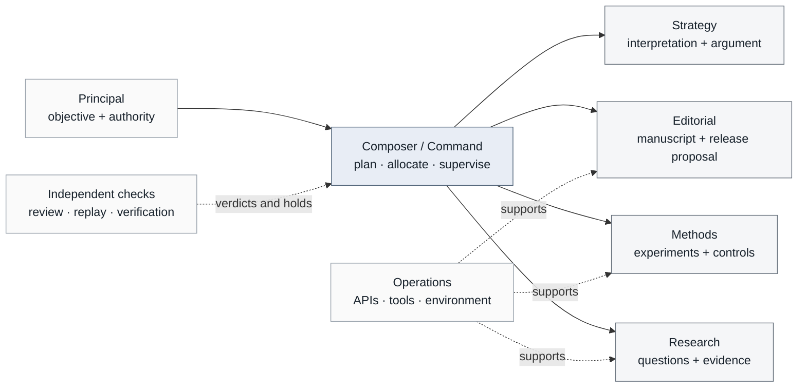
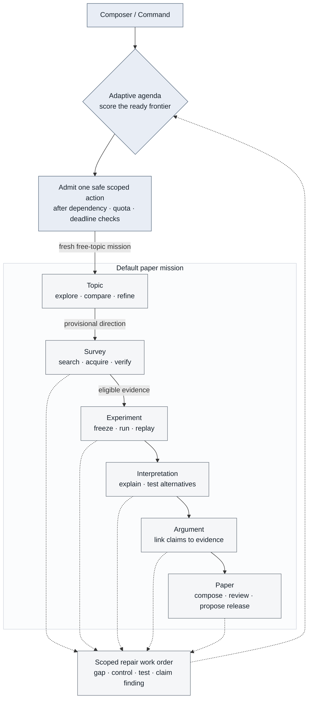

<div align="center">

# 🦖 Sci-saurus

### A bounded, auditable research organization for turning compute into verified progress.

Autonomous within mission bounds · evidence-first · resumable · provider-aware

[](https://github.com/codeshark94/Sci-saurus/actions/workflows/tests.yml)

[](docs/00-SSOT.md)

</div>

> Sci-saurus is not a chatbot that pretends to be a scientist. It is a
> Principal-directed control plane that turns goals into bounded work,
> evidence, artifacts, independent checks, and explicit next decisions.

## At a glance

Sci-saurus coordinates a project-scoped organization of on-demand specialists.
The Principal sets the objective, authority, trade-offs, and release boundary.
Once a mission is admitted, the Composer plans and supervises work;
departments investigate, construct, challenge, verify, revise, and choose the
next scoped recovery action without asking a person to invent a pivot. The
Archivist preserves the trail.

The paper mission has hard evidence dependencies, but it is not a one-way
assembly line. The Composer keeps a live research frontier and can reopen the
smallest affected scope:

```text
candidate portfolio → literature probe ↔ topic refinement
                              ↓
                    experiment ↔ added evidence
                              ↓
             interpretation ↔ discriminating test
                              ↓
                  argument ↔ claim repair
                              ↓
                    paper ↔ adversarial review
```

When several dependency-ready activities exist, an adaptive agenda favors
evidence-producing work, active work orders, and actions that unlock useful
downstream work. Seeded exploration breaks close ties. Every choice and
alternative is checkpointed; final release authority remains with the Principal.
A failed adaptive attempt yields back to the global agenda with a persisted
not-before boundary, so another ready evidence action can run during backoff.
Hard dependencies may correctly leave a single initial frontier; the flow
becomes non-linear through retained candidate branches and evidence-triggered
reopenings rather than by bypassing those dependencies.

The same runtime can also produce bounded reports, guides, JSON artifacts, and
Python source units. A scientific result is never inferred from a model response
or a successful process exit alone.

For free-topic missions, topic discovery is materialized as a provisional
research program: all candidate branches are retained with supportive,
null/boundary, and ambiguous outcome rules plus a declared kill condition. The
argument stage then writes an evidence-bound defense ledger that separates
observations, inferences, provisional explanations, limitations, and future
tests. Missing evidence remains a research request; it cannot be repaired by
confident prose.

Licensed under the [MIT License](LICENSE).

## How the organization works



The accountability map above is not an execution itinerary. Runtime selection
is shown separately:



Solid arrows are scientific dependencies. Dotted arrows return a finding to
the Composer for scoped repair and re-planning; they are not direct bypasses.
For a fresh free-topic mission the first admission is Topic, while later
admissions can target any currently dependency-ready stage. A run may revisit
an earlier stage or pursue a parallel-ready repair without pretending that a
later stage is already accepted.

| Boundary | Responsibility |
|---|---|
| **Principal** | Sets the destination, prohibitions, priorities, and release authority |
| **Composer / Command** | Admits stages, allocates bounded capacity, routes repair, and controls resume |
| **Research** | Finds questions, sources, identities, evidence, and literature gaps |
| **Methods** | Freezes methods, runs controls and replay, recalculates results, and checks reproducibility |
| **Strategy** | Interprets results, tests alternatives, and links claims to evidence |
| **Editorial** | Structures, edits, renders, and assembles the release candidate |
| **Operations** | Makes declared APIs, programs, MCP services, and environments work when needed |
| **Archivist** | Keeps immutable artifacts, provenance, event history, and release records |

Departments are accountability boundaries, not permanent model processes. The
default organization exposes an eligible bounded roster; a stage activates only
the specialists it needs and gives each one a scoped task, artifact namespace,
quota, and verifier.

## Default specialist pools

| Department | Example on-demand appointments | Independent challenge |
|---|---|---|
| **Research** | frontier scout · search strategist · academic scout · source acquirer · citation mapper · cataloger · fact verifier · topic-maturity reviewer | `research.adversarial-reviewer` |
| **Methods** | methodologist · statistical reviewer · reproducibility reviewer · analysis reviewer · control designer | `methods.adversarial-reviewer` |
| **Strategy** | mechanism interpreter · planner · narrative architect · evidence linker · section writer | `strategy.adversarial-reviewer` |
| **Editorial** | writer · structural editor · format editor · consistency QA · journal editor | `editorial.human-scientist-reviewer` |
| **Operations** | tool/environment engineer · execution operator · operational verifier · runtime auditor | `operations.operational-adversary` |

The full roster, role contracts, input projections, stage routes, quotas, and
custom-chief migration rules live in [Project Organization](docs/15-project-organization.md)
and [Agent, Department, and Stage Flow](docs/16-agent-department-flow.md).

## What is implemented

| Capability | Runtime boundary |
|---|---|
| **Durable control plane** | SQLite state, event hash chain, leases, fencing, idempotent effects, and task/attempt lifecycle |
| **Immutable artifacts** | Content-addressed versions, provenance, adoption checks, scoped edit grants, and change sets |
| **Independent review** | Field-level critiques, rebuttals, adjudication, verification closure, and adversarial gates |
| **Bounded specialist execution** | Role contracts, temporary assignments, per-stage quotas, artifact namespaces, chief synthesis, and independent verdicts |
| **Literature survey** | OpenAlex discovery, source capture, identity reconciliation, exact source spans, citation maps, counter-search, and gap assessment |
| **Topic feasibility admission** | Machine-checked execution mode, input provenance/readiness, data boundary, dependencies, network access, API/model estimates, and experiment deadline before a topic enters the survey |
| **Scientific experiments** | Frozen methods and seeds, deterministic replay, independent recalculation, raw observations, figures, and result-package review |
| **Paper pipeline** | Frozen storyline, claim/evidence index, bibliography, figures, LaTeX, rendered PDF, and release manifest |
| **Research program and defense ledger** | Candidate branches with conditional paper outcomes, retained alternatives, posture-separated argumentation, and reviewer-visible weak points |
| **Resume and time policy** | Checkpoints, deadline-aware replanning, unknown-call reconciliation, retained failures, and scoped repair |
| **Adaptive research agenda** | Dependency-ready work ranked by information value, active work orders, downstream unlocks, and reproducible seeded exploration |
| **Tool acquisition** | Allowlisted programs, APIs, and MCP services with readiness probes and drift-aware bindings |

“Implemented” means the bounded runtime contract is present and regression
tested. It does not mean that a run has discovered a novel result, passed expert
peer review, or been submitted to a journal.

## Run it

Install the repository runtime and run the acceptance suite:

```bash
sh scripts/setup-runtime.sh
python3 -m unittest discover -s scisaurus/tests -t . -v
```

Initialize and verify a project:

```bash
python3 -m scisaurus.cli init /tmp/my-project
python3 -m scisaurus.cli publish /tmp/my-project strategy/notes/demo brief.md --type note
python3 -m scisaurus.cli verify /tmp/my-project
```

Prepare a bounded surface, then edit the generated configuration to add the
authorized model endpoint and set `live_dispatch_allowed` to `true`:

| Goal | Prepare | Run |
|---|---|---|
| Paragraph revision | `scripts/setup-runtime.sh` | `python3 -m scisaurus.cli run-paragraph PROJECT --config CONFIG.json` |
| Multi-paragraph project | `scripts/prepare-project-config.py` | `python3 -m scisaurus.cli run-project PROJECT --config CONFIG.json` |
| Literature survey | `scripts/prepare-survey-config.py` | `python3 -m scisaurus.cli run-survey PROJECT --config CONFIG.json` |
| Scientific experiment | `scripts/setup-experiment-runtime.sh` + `scripts/prepare-experiment-config.py` | `python3 -m scisaurus.cli run-experiment PROJECT --config CONFIG.json` |
| Composer mission | `./run` | `./run` |
| Local workspace console | `./dashboard [WORKSPACE]` | `./dashboard` |

The templates are intentionally inert until the operator supplies the
authorized connection and dispatch permission. See the detailed runtime guide
before using live providers.

## Guardrails that matter

- **Human authority is explicit.** The Principal owns mission scope and final release.
- **Scientific recovery is autonomous.** A hold, rejected direction, or missing typed repair order produces a cycle-specific work order, changes the strategy, and reopens only the affected closure. Human input is not the normal next step.
- **Only real fences stop autonomous progress.** Topic intake retries share one bounded intake envelope, and every deliberate continuation pivot receives its own bounded envelope. Provider/account limits, API policy, worker capacity, and the mission deadline remain independently reserved and recorded; a historical pivot cannot exhaust the budget of a newly admitted direction.
- **Resource fences are not scientific decisions.** A resettable provider/API cooldown is waited out and retried automatically in autonomous mode; exhausted quotas, worker capacity, and the mission deadline remain hard resource boundaries recorded in the checkpoint, never scientific conclusions.
- **Failure is not success.** A timeout, provider block, malformed response, or rejected review remains visible and scoped.
- **Evidence is claim-level.** Literature claims require exact source references and stable spans; metadata is not scientific evidence.
- **Experiments are bounded.** A deterministic replay proves reproducibility of the pinned execution, not mathematical truth or real-world novelty.
- **Topic feasibility is explicit.** A prose feasibility note is never enough: experiment-backed topic admission checks the actual execution boundary, every input, dependency availability, network use, provider/model work, compute estimate, and disconfirmation-oriented study shape. The current deterministic project boundary admits only self-contained closed-world inputs, zero experiment-side API/model calls, and the foundry timeout; topic intake has its own bounded intake/continuation envelopes.
- **OpenAlex topic intake fails closed.** Provider cooldown state is persisted; 429s stop fresh query variants until the recorded provider boundary, while bounded retries honor provider cooldown metadata. Crossref identity metadata cannot substitute for the citation graph used for topic discovery.
- **Specialists are on demand.** A 34-role roster does not mean 34 model processes are running.
- **LangGraph is optional, not the control plane.** The native Composer, TaskManager, and ArtifactStore own lifecycle and provenance; adapters can be used per department where useful.

## Documentation map

| Start here | Covers |
|---|---|
| [Concept SSOT](docs/00-SSOT.md) | Authority, terminology, and governing decisions |
| [System concept](docs/05-system-concept.md) | Mission, activity graph, and anytime progress |
| [Architecture](docs/20-architecture-v0.md) | Control plane, evidence, storage, and gates |
| [Project organization](docs/15-project-organization.md) | Rosters, contracts, custom organizations, and Operations Cell |
| [Agent / department / stage flow](docs/16-agent-department-flow.md) | Routing, assignments, handoffs, and scoped continuation |
| [Composer runtime](docs/110-composer-runtime.md) | End-to-end stage admission, review, reallocation, and resume |
| [Local dashboard](docs/120-local-dashboard.md) | Workspace overview, project drill-down, research progress, bounded project creation, and Composer start/resume |
| [Literature survey](docs/75-literature-survey-score.md) | Search, source spans, citation maps, and gap assessment |
| [Experiment runtime](docs/90-experiment-runtime.md) | Frozen studies, replay, recalculation, and result packages |
| [Completion runtime](docs/80-completion-runtime.md) | Paper release candidates, evaluation, and delivery boundaries |
| [Roadmap](docs/30-roadmap.md) | Remaining phases and acceptance scenarios |

## Current status

The durable P1 control plane, project organization, bounded specialist routing,
literature workflow, experiment runtime, manuscript pipeline, and resume paths
are implemented and regression tested. The remaining scientific claims are
deliberately open: expert-held-out evaluation, repeated complete live missions,
measured quality-versus-compute comparisons, and any external publication.

For the normative contract, start with the [Concept SSOT](docs/00-SSOT.md). For
the operational model, start with [Composer runtime](docs/110-composer-runtime.md).
