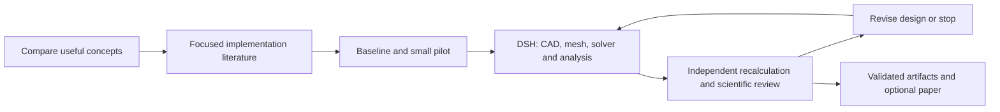
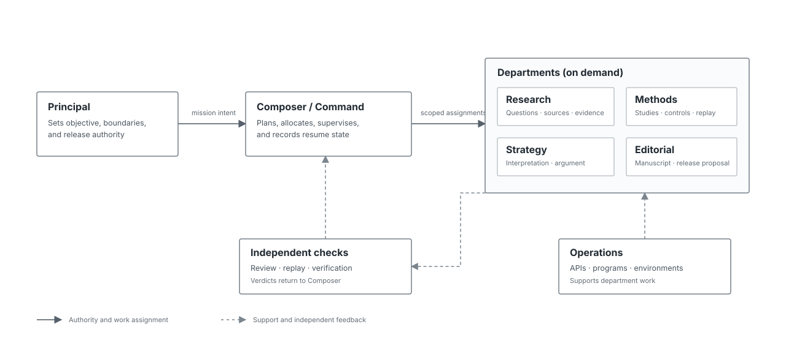

<div align="center">

# 🐋 Sci-whale

**A concept-led laboratory for metamaterial design and simulation.**

Bounded missions · Independent checks · Resumable work · Explicit release authority

[](https://github.com/codeshark94/Sci-whale/actions/workflows/tests.yml)

[](docs/00-SSOT.md)

</div>

Sci-whale develops testable material concepts through CAD, open-source simulation,
small discriminating experiments, and design revisions. The Principal sets the
useful physical function and constraints. Composer controls scope and evidence;
DSH performs technical production; independent reviewers check the current
implementation and results. Paper preparation follows demonstrated results.

## Development loop


```mermaid
flowchart LR
    C[Compare useful concepts] --> L[Focused implementation literature]
    L --> B[Baseline and small pilot]
    B --> D[DSH: CAD, mesh, solver and analysis]
    D --> V[Independent recalculation and scientific review]
    V --> R[Revise design or stop]
    R --> D
    V --> A[Validated artifacts and optional paper]
```

A concept does not need a completed publication argument before an authorized
exploratory pilot. Its novelty and performance remain unverified until supported
by evidence. Inconsistent geometry, missing critical inputs, unsupported physics,
and invalid execution still block the affected work. Negative results can guide
the next design; a run that does not test the question cannot establish a null.

## How the organization works

Authority, coordination, specialist work, operations, and independent checks
have separate responsibilities. Specialists are activated for scoped tasks;
the default roster does not mean a fixed set of model processes is running.



Solid arrows show direction and work assignment. Dashed paths show operational
support and independent review feedback.

## Mission control

Composer admits dependency-ready work and reopens only the affected scope.
Concept missions retain alternative designs, measurable outcomes and stop rules.
Completed literature is reused with its exact provenance; an implementation
repair belongs to its author and does not restart the whole survey. A completed
response-format repair closes independently of a remaining scientific hold.

The general research and manuscript stage graph remains available for missions
that require it. It is not a compulsory publication sequence for every design
iteration.

## Runtime capabilities

| Area | What the runtime provides |
|---|---|
| **Mission control** | Durable project state, event history, leases, checkpoints, adaptive ranking of dependency-ready work, and resumable decisions |
| **Evidence and artifacts** | Immutable, content-addressed versions; provenance; scoped edits; literature identities; exact source references and spans |
| **Literature workflow** | OpenAlex and configured Semantic Scholar access, bounded HTML/XML and open-access PDF capture, identity reconciliation, citation maps, counter-search, and gap assessment |
| **Engineering worker** | Headless DSH jobs with a fixed model, file editing, shell execution, local repair, durable receipts and independent admission; see [DSH batches](docs/dsh-batch.md) |
| **Scientific execution** | Frozen methods and seeds, raw observations, deterministic replay, independent recalculation, and reviewed result packages |
| **Recovery** | Failure dossiers, typed work orders, bounded capability repair, and reopening of affected downstream dependencies |
| **CAD and multiphysics** | Isolated FreeCAD, Gmsh, continuum and wave environments; optional attested Linux solver containers; explicit field handoff and coupling limits |
| **Paper delivery** | Claim/evidence index, bibliography, figures, LaTeX source, rendered PDF, and a release proposal with provenance |
| **Tools and environments** | Allowlisted programs, APIs, and MCP services with readiness checks and drift-aware bindings |

## Evidence and operating boundaries

- **The Principal owns the mandate and release boundary.** Live provider access
  and dispatch remain inactive until the operator configures an authorized
  endpoint and enables `live_dispatch_allowed`.
- **Claims stay tied to evidence.** Literature support uses exact references
  and stable source spans; metadata alone is not scientific evidence.
- **A process exit is not a scientific result.** Experiments require the
  declared checks, replay, recalculation, and review. Replay establishes
  repeatability for the pinned execution, not truth or novelty.
- **Provisional work stays visible.** Under `forward_first`, an observed
  candidate may continue as `candidate_needs_review` with its failure debt
  recorded. It remains unverified and cannot satisfy final release gates. A
  generated capability that has never executed cannot be forwarded as a
  result; it enters the experiment repair loop.
- **Failures keep their meaning.** Scientific holds create evidence-bound
  repair orders. Provider cooldowns, exhausted quotas, unknown calls, and
  deadlines remain operational blocks. Malformed model output receives a
  separate schema repair and cannot create a scientific pivot.
- **The organization can report honest partial progress.** A missing source,
  unresolved alternative, failed check, or blocked dependency remains explicit
  in the checkpoint rather than being replaced with confident prose.

## Quick start

Install the control runtime; this does not install scientific solvers or enable model dispatch:

```bash
sh scripts/setup-runtime.sh
```

Initialize a project and verify its record:

```bash
./sci-whale init /tmp/my-project
./sci-whale verify /tmp/my-project
```

For CAD, solvers, DSH and desktop dependencies, follow the
[dependency guide](docs/10-runtime-dependencies.md) and
[laboratory preparation](docs/140-metamaterial-laboratory.md). The desktop app
provides Start, Stop and Resume; closing its window preserves managed execution.
All model clients and DSH jobs share at most **three concurrent dispatch slots**.

## Prepare and run a workflow

| Goal | Prepare | Run |
|---|---|---|
| Paragraph revision | `scripts/setup-runtime.sh` | `./sci-whale run-paragraph PROJECT --config CONFIG.json` |
| Multi-paragraph project | `scripts/prepare-project-config.py` | `./sci-whale run-project PROJECT --config CONFIG.json` |
| Literature survey | `scripts/prepare-survey-config.py` | `./sci-whale run-survey PROJECT --config CONFIG.json` |
| Scientific experiment | `scripts/setup-experiment-runtime.sh` + `scripts/prepare-experiment-config.py` | `./sci-whale run-experiment PROJECT --config CONFIG.json` |
| Composer mission | `./run` | `./run` |
| Local workspace console | `./dashboard [WORKSPACE]` | `./dashboard` |

Generated configurations are inert until the operator supplies the authorized
connection and dispatch permission. Read the matching runtime guide before
using live providers.

## Documentation

| Start here | Covers |
|---|---|
| [Runtime dependencies](docs/10-runtime-dependencies.md) · [DSH batches](docs/dsh-batch.md) | Installation boundaries, pinned recipes, engineering delegation and readiness |
| [Concept SSOT](docs/00-SSOT.md) · [System concept](docs/05-system-concept.md) · [Architecture](docs/20-architecture-v0.md) | Authority, terminology, activity model, control plane, evidence, and gates |
| [Project organization](docs/15-project-organization.md) · [Agent / department / stage flow](docs/16-agent-department-flow.md) · [Composer runtime](docs/110-composer-runtime.md) | Roles, routing, assignments, admission, repair, and resume |
| [Literature survey](docs/75-literature-survey-score.md) · [Experiment runtime](docs/90-experiment-runtime.md) · [Research argument](docs/100-research-argument-runtime.md) | Source review, experiments, interpretation, and claim construction |
| [Completion runtime](docs/80-completion-runtime.md) · [Critical review articles](docs/115-review-articles.md) | Manuscript assembly, evaluation, rendered review, and delivery boundaries |
| [Local dashboard](docs/120-local-dashboard.md) · [Desktop app](docs/130-desktop-app.md) · [Roadmap](docs/30-roadmap.md) | Workspace operation, desktop controls, and remaining work |
| [Metamaterial laboratory](docs/140-metamaterial-laboratory.md) | Concept development, CAD/multiphysics scope, provisioned runtimes, artifact handoff, and operational probes |

## Current status

The control plane, concept development contracts, DSH delegation, isolated
laboratory execution, bounded specialist routing,
literature workflow, experiment runtime, manuscript pipeline, and resume paths
are implemented and covered by regression tests. Installing a solver or passing
an operational probe does not demonstrate a useful metamaterial. Expert-held-out
evaluation, repeated
complete live missions, measured quality-versus-compute comparisons, and any
external publication remain open. Runtime capability is not evidence of a
scientific result.

Licensed under the [MIT License](LICENSE).
