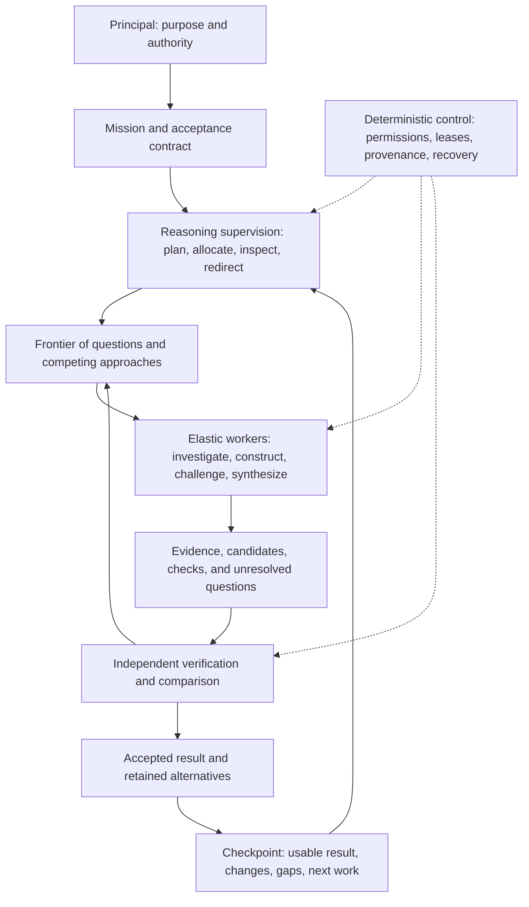

# Sci-saurus — System Concept

> **Version:** v0.8 · **Date:** 2026-09-10 · **Status:** proposed system design, not measured runtime behavior.
> Governing decisions: [Concept SSOT](00-SSOT.md), especially D25–D36. Field definitions: [Execution Contract](40-execution-contract.md).

## 1. Purpose

Sci-saurus is a research organization for turning abundant inference capacity into useful results over time. It can pursue multiple explanations, inspect difficult evidence, try competing constructions, and challenge its own choices. The human Principal sets the destination. The organization decides how to investigate and produce within that mandate.

The default resource premise is plentiful external GPU capacity. The design therefore favors capable models, substantial deliberation, broad parallel exploration, and strong independent verification when these can improve the result. Token minimization is not the objective. Attention to the right questions, external evidence, verifier reliability, coordination delay, and elapsed time remain constraints even with abundant GPUs.

The first application is paper production from supplied results. Paper stages are delivery milestones; they do not define the limits or order of internal thought. New experimental execution remains a later capability, distinct from inference running on remote GPUs.

## 2. Organizing model

There are three complementary structures:

| Structure | What it represents | What changes during a mission |
|---|---|---|
| Mission contract | Required outcome, coverage, authority, priorities, completion conditions | Material changes require the Principal's authority |
| Activity graph | Questions, hypotheses, constructions, evidence dependencies, checks, and decisions | Tasks can be added, split, combined, reordered, suspended, or abandoned within delegation |
| Responsibility map | Research, Strategy, Methods, Editorial, and Command | Specialists form temporary groups across departments; artifact ownership and review independence remain explicit |

Departments retain knowledge and accountability. They are not sequential queues through which every idea must pass. A useful working group might combine a search specialist, methodologist, writer, and verifier around one disputed claim and dissolve after resolving it.

One durable Task graph implements activities; no separate autonomous graph runtime is required. Cross-department dependencies and provisional branches are explicit edges in that graph.

### 2.1 Project instances and a practical operations team

Each research project instantiates this organization with its own mission, private knowledge, artifacts, capabilities, environment, and decisions. Shared models or reusable tool recipes do not merge project authority or data. The framework repository is distinct from the research projects it operates.

Activate an Operations Cell when a project needs an open-source program installed or run, an API/MCP service connected, an adapter built, or an environment repaired. It owns making the capability work on actual project inputs and preserving execution evidence. Qualified departments retain scientific and editorial judgment. Existing verified tools remain directly callable by specialists, so the cell does not become another approval queue.

The cell can shrink to one operator or assign environment, integration, execution, and independent verification roles as the case requires. After verification it becomes idle or closes; the reusable project capability and its operating records remain. [Project organization and operations](15-project-organization.md) defines activation, execution, project isolation, and handoff.

## 3. Reasoning as a supervised portfolio

Each admitted activity states its mission contribution, question or construction objective, current assumptions, input versions, intended output, evaluation method, resource lease, and next checkpoint. An exploratory activity need not predict a positive result, but it must explain what would make its outcome useful and when to reassess it.

The frontier can contain:

- evidence gathering and counterexample searches;
- deeper work on a promising approach;
- independent alternative explanations or candidate artifacts;
- synthesis across promising branches;
- challenge, repair, verification, and candidate comparison;
- diagnosis of the planner, evaluator, or retrieval method when their decisions fail.

The supervisor allocates work across this portfolio. It does not simply choose the highest self-scored candidate or polish the current draft forever. Preserve a small, revisable set of materially different approaches when their trade-offs are unresolved. Their number follows the mission and observed capacity; there is no universal branch count.

Alternative generation should vary substantive assumptions, source routes, decompositions, or construction methods. Repeated samples with different role names do not establish independent evidence. Record overlap and shared failure modes when comparing them.

## 4. Exploration, commitment, and oversight

Exploration may use explicitly provisional hypotheses or candidate inputs. Such work remains provisional, carries its dependencies, and cannot be presented as an accepted finding. This permits early argument sketches, parallel outline alternatives, and Methods investigations before the whole survey finishes.

Commitment has a stricter boundary. A substantive result becomes an accepted dependency only after the required evidence, adversarial coverage, non-regression checks, and scoped approvals pass. Verification covers the exact content and dependency versions. Unrelated work continues when one branch is blocked.

The graph distinguishes accepted premises from subjects being inspected. A reviewer can examine an unaccepted candidate and establish a supported verdict without first accepting that candidate. Its disputed assertions are not silently treated as facts. This prevents the review process from depending on its own outcome.

Supervision has three levels:

| Level | Responsibility | Decision boundary |
|---|---|---|
| Local task stewardship | Clarify the question, choose an allowed method, inspect outputs, propose follow-up | Existing task delegation and lease |
| Mission supervision | Compare alternatives, allocate capacity, handle bottlenecks, investigate stagnation, assess progress | Fixed intent and acceptance contract |
| Independent oversight | Challenge consequential allocation, closure, and evaluation decisions; inspect sampled routine decisions | Evidence, conflict checks, and the Principal's authority |

Executive Command implements mission supervision through its existing roles. The Composer plans, the Progress Controller evaluates allocation, the Arbiter handles disputed judgments, and the Intent Keeper checks direction. These are responsibilities, not four mandatory model calls per task.

The supervisor records the chosen action, credible alternatives, expected benefit, and reassessment condition. All activities are subject to oversight, but dispatch within an active delegation need not wait for a new supervisory LLM judgment. Consequential decisions and contradictory outcomes trigger independent review; routine decisions are sampled. Mechanical admission and checks stay in code.

The supervisor is fallible. Disagreement with evidence, failed predictions, systematically rejected candidates, or repeated sterile review can trigger an independent diagnosis of the supervisor or evaluation method. A disputed decision goes to a non-conflicted adjudicator. Continuing uncertainty produces a bounded investigation, a provisional state, or a request to the Principal. Recursive reviewers do not create final certainty.

### 4.1 Surgical revision and structural memory

A deliverable is composed of stable, versioned sections, paragraphs, and other meaningful units. Each unit has a purpose, exact claim/reference bindings, review coverage, and revision history. A document manifest pins their versions and order. Broad read access supports reasoning; an edit grant limits changes to exact units, fields, spans, and structural operations.

An edit starts from a named problem and preservation requirements. Workers propose local ChangeSets; the service rejects out-of-scope changes and composes independently verified patches. Shared definitions, references, figures, and templates are separately controlled because small changes there can alter many untouched paragraphs. Larger reorganizations use a justified, coordinated plan with scoped sub-grants and review of the assembled result.

If a corrected Discussion claim also affects the abstract, those are linked repairs. Their verification can cover the whole argument without allowing one worker to rewrite it. Coupled changes enter the accepted document together. [Structured artifact and change-control contract](45-artifact-change-control.md) defines identities, concurrency, source tracking, and recovery.

### 4.2 Active web intelligence

External retrieval runs throughout the activity graph. Departments directly search when evidence, terminology, novelty, methods, venue requirements, or tools need investigation. Search plans expand and follow citations, authors, repositories, and counterexamples when those routes have decision value. Independent reviewers retain their own retrieval routes and capacity.

The organization maintains a live capability registry for direct APIs, connected tools, and optional MCP/plugin adapters. It can select already authorized capabilities, request missing integrations, and check their actual behavior. New information is captured and verified before it changes a claim; accepted claims and paragraphs change only through scoped proposals. [Web integration design](50-web-intelligence-integration.md) specifies the first adapters and implementation sequence.

### 4.3 Scientific interpretation and argument construction

Evidence and a result table are not yet an explanation. Scientific
Interpretation identifies the result patterns that matter, states what each
pattern means, keeps competing mechanisms at the level justified by the
evidence, and proposes discriminating follow-up experiments. The
Research-Argument stage then turns that interpretation into a versioned
question, competing-hypothesis map, bounded thesis, and figure/table plan.
Independent adjudication must accept this map before a writer is admitted. The
writer receives the accepted argument together with the evidence ledger; it
cannot invent a thesis, turn a possible mechanism into a fact, or use a figure
as decoration without a reader-facing job.

The final assembly then projects the control plane into a reader-facing scientific surface. Operational labels, hashes, reservations, repair scopes, and reviewer bookkeeping remain queryable in the project archive and reproducibility note; the article describes the dataset, method, result, uncertainty, and implication in public academic language. An editorial compression gate checks that numeric facts and caveats are not repeated mechanically, that Results reports observations while Discussion explains them, that each figure makes an argument in the text, and that limitations are retained because they change the conclusion's scope.

## 5. Generous compute with executable boundaries

Separate three resource concepts:

1. **Authority:** which endpoints, models, tools, data transfers, and expenditure are already permitted.
2. **Capacity:** measured concurrency, memory/context limits, throughput, availability, and provider rate limits.
3. **Leases:** finite reservations, attempt deadlines, and planning windows that make execution cancellable and recoverable.

An authorized capacity pool may be used through automatically renewable windows until completion, cancellation, a mission limit, or a justified pause. Reaching a window boundary is an allocation checkpoint; it is not a lifetime cap on reasoning and does not itself require another human approval. Metered services still obey an explicit expenditure envelope. Missing authorization never means unlimited permission.

The allocation order is intent-defined. As an initial policy, address validity and missing critical evidence, keep verification and integration moving, deepen promising work, and preserve capacity for materially different alternatives. Adapt this order when observed bottlenecks or mission priorities justify it. Do not invent fixed percentage weights for exploration versus verification.

Remote GPU workers are an initial deployment target, behind the same runner contract as local inference. The control plane keeps durable state; workers receive scoped contexts and return candidate outputs. A cancelled or expired lease cannot later publish an authoritative result. More producers are admitted only when evidence acquisition, review, and integration can absorb their output.

Fixed review-round and message-count ceilings are replaced by checkpoints, causal deduplication, provider failure handling, and evidence-backed continuation decisions. Operational retries remain bounded. Window renewal preserves the complete causal history, cumulative usage, and stagnation state.

## 6. Progress over elapsed time

The system should be useful before the entire mission is finished. Every configured wall-clock checkpoint exposes the best currently admissible result, or an explicit statement that none exists, together with validated changes, remaining uncertainties, spent resources, and the next allocation decision. A checkpoint need not be a human interruption; it is a durable project status artifact.

Track three distinct views:

| View | Evidence of value | What does not count |
|---|---|---|
| Deliverable progress | Independently accepted improvement with required coverage preserved | More text, more versions, or fewer issues alone |
| Information progress | A verified discovery changes a decision, eliminates a live alternative, resolves uncertainty, or exposes a material defect | Rephrased beliefs or unsupported confidence |
| Execution health | Checkpoint punctuality, queue age, completed checks, recoverability, and observed capacity | Scientific improvement by itself |

An information gain must name the affected question or decision, the previous state, new support, and the resulting change. Deduplicate causal discoveries across branches. Negative results can count when the search/check was appropriate and its scope is explicit. An empty web query alone cannot establish absence of prior work.

Preserve the incumbent and materially useful alternatives. Promotion must improve an intent-relevant criterion without violating hard requirements or an unauthorized trade-off. Incomparable candidates remain alternatives. New evidence may invalidate the incumbent; checkpoints must then show that loss rather than maintain a fictitious monotonic quality curve.

The enforceable guarantee is regular, truthful accounting and a deliberate response to stagnation. Scientific improvement at every time interval cannot be guaranteed. A long investigation can span several checkpoints when it has justified intermediate milestones and a declared reassessment horizon; absence of an immediate artifact is not grounds for automatic cancellation.

## 7. Stagnation and completion

When progress falls below the mission's declared expectations, diagnose the cause before adding more agents:

| Observed condition | Next response |
|---|---|
| Repeated edits with no accepted improvement | Revisit the question, candidate family, or acceptance interpretation |
| Many independent-looking answers with shared assumptions | Try a different decomposition, model profile, or evidence route |
| Persistent material disagreement | Seek discriminating evidence or a qualified independent check |
| Growing unverified candidate backlog | Shift capacity from production to verification and integration |
| Missing external evidence | Acquire it, pursue an independent question, or report the specific dependency |
| Supervisor repeatedly predicts benefit that does not materialize | Independently examine its selection policy and evaluator |

A continuation decision identifies what is different or why an ongoing long-horizon activity remains justified. Renaming an issue, changing agent IDs, or renewing a lease cannot reset the evidence of stagnation. Method changes within delegation may proceed; changes to goals, acceptance standards, or authority require the Principal.

Completion is a verified deliverable satisfying the mission's stop condition, not exhaustion of the available GPUs. At completion, propose the release and stop discretionary work unless ongoing improvement is explicitly part of the mission. A blocked mission returns the usable partial result and exact missing conditions. It does not endlessly manufacture tasks to appear alive.

## 8. Paper workflow example

From a supplied results package, Research opens independent evidence routes while Methods checks the supplied inference and Strategy constructs competing contribution statements. Editorial can test the document skeleton concurrently. Provisional branches remain visibly provisional.

A prior-work collision can redirect the affected contribution branch without restarting valid transcription or rendering work. Methods and independent retrieval determine whether the collision is real. Strategy develops alternatives under the original scope. A narrower claim that still meets the required outcome may advance after verification; abandoning a required contribution needs a scope decision.

At a checkpoint the Principal can inspect the current argument, claim/evidence map, reviewed manuscript sections, unresolved disputes, and why the next work was selected. Review capacity grows with the substantive candidate backlog. A polished but unsupported manuscript cannot become the incumbent merely because a stronger candidate takes longer.

## 9. First implementation and evaluation

Build one durable, concurrent improvement loop before implementing the full role catalog. It needs a mission contract, immutable artifacts, Tasks and leases, an elastic worker adapter, independent review and selection, and progress checkpoints. Use a compact supplied-results case with a real overclaim, a sound claim, missing evidence, and competing candidate approaches.

The first demonstration must show automatic lease renewal inside an existing delegation, redirection after unproductive work, preservation of valid coverage, correct rejection of a false criticism, and independent repair verification. It must also survive worker loss and resume without accepting stale outputs. Remote inference is exercised early; framework proliferation is deferred.

Evaluate both equal-resource quality and equal-wall-clock usefulness. Compare a capable single-agent workflow, independent candidates with verification, and the supervised activity graph. Plot accepted quality and material discoveries over elapsed time, time to first usable result, stagnation duration, review backlog, and resource usage. Use held-out cases and external checks; supervisor scores are diagnostics. The question is whether abundant compute becomes earlier or better defensible results.

## 10. Research rationale and limits

These studies motivate design hypotheses; they do not validate Sci-saurus or guarantee open-ended research progress.

- Snell et al., [Scaling LLM Test-Time Compute Optimally can be More Effective than Scaling Model Parameters](https://arxiv.org/abs/2408.03314), found that effective compute allocation varied by difficulty and model in their mathematical reasoning experiments. The study used specialized revision/verifier training and also reported verifier over-optimization. **Design inference:** compare adaptive depth, breadth, and verification while measuring controller overhead and independent quality.
- Wang et al., [Self-Consistency Improves Chain of Thought Reasoning in Language Models](https://arxiv.org/abs/2203.11171), improved evaluated arithmetic and commonsense benchmarks through diverse sampled reasoning paths and answer aggregation. **Design inference:** preserve different approaches; agreement in open-ended research remains a signal to investigate, not proof.
- Huang et al., [Large Language Models Cannot Self-Correct Reasoning Yet](https://arxiv.org/abs/2310.01798), found unreliable intrinsic self-correction without external feedback in the models and tasks they evaluated. **Design inference:** connect repair decisions to inspectable evidence and independent checks. This is not a universal claim about all later models or tool-supported correction.
- Hay et al., [Selecting Computations: Theory and Applications](https://arxiv.org/abs/1207.5879), formulate choosing computations and stopping in terms of expected decision utility and computation cost under specified models. **Design inference:** assess what the next activity could change in the mission, including time and uncertainty. Do not pretend uncalibrated LLM value estimates satisfy the theory's assumptions.
