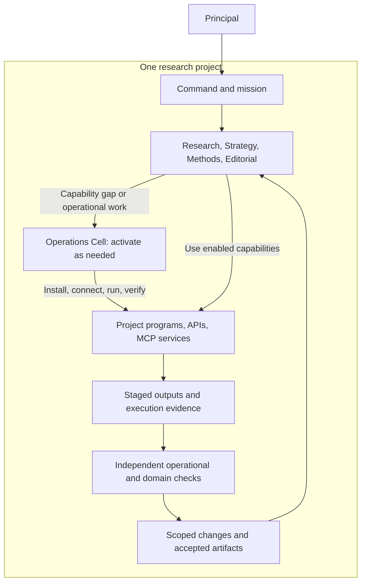

# Sci-saurus — Project Organization and Operations

> **Version:** v1.5 · **Date:** 2026-09-13 · **Status:** project-scoped department runtime and Composer-controlled work-order lifecycle implemented; configured operational adapters remain the execution boundary.
> Governed by [SSOT](00-SSOT.md) D35–D36. Integrates the [activity model](05-system-concept.md), [web/tool adapters](50-web-intelligence-integration.md), and [scoped artifact changes](45-artifact-change-control.md).

## 1. One operating organization per project

A project instantiates its own organization: PrincipalIntent and missions, Command, departmental responsibilities, delegated capabilities, work graph, evidence, deliverables, and operational environment. A mission or Score is a mode of work inside that project, not permission to mix other projects' knowledge or state.

Research, Strategy, Methods, and Editorial retain responsibility throughout a project. Their active specialists change with the work. An Operations Cell is activated when actual environment, program, or service operation is needed. It is a practical support function under Command, with no authority to set research goals or decide that tool output is scientifically valid.

Shared infrastructure may supply worker/GPU pools, role templates, approved adapter implementations, and immutable public software caches. Mutable workspaces, credentials, private context, evidence, accepted heads, grants, and decision histories remain project-scoped. A shared capacity scheduler accounts for aggregate provider/GPU limits while project ledgers retain attribution; a project cannot grant itself another project's capacity or data.

The runtime realization is `DepartmentRuntime` in
[`scisaurus/runtime/departments.py`](../scisaurus/runtime/departments.py). It
materializes a project organization when the Composer opens a run: a default
charter is published as an immutable command artifact, each incoming handoff
is copied into the addressed department inbox, and a validated request becomes
a typed work-order task. A workflow may supply a different organization
charter, but the template is only a starting contract; actual inbox requests,
stage results, and capability state determine which work is admitted. The
Composer records activation and resolution of scoped work orders in every
checkpoint, so the backlog describes live work rather than a diagram of roles.

Autonomy is deadline-governed. A malformed proposal is rejected into a durable
department record and does not terminate unrelated work. A valid blocker is
retried or reopened through its owning stage closure until the immutable mission
wall, while the Arbiter and the Principal retain authority over disputes,
material scope changes, and release. Department workers cannot overwrite an
incumbent artifact or grant themselves an unconfigured host, API, or MCP
capability.



## 2. When to activate the Operations Cell

| Trigger | Concrete work | Completion evidence |
|---|---|---|
| A useful open-source program is absent | Inspect suitability, prepare project environment, install/build a pinned revision, configure it | Representative command/API execution with inspected output |
| A required API or MCP capability is not usable | Implement/configure an adapter or server, bind project credentials and operations, verify the schema | Successful project-runtime call and normalized result with provenance |
| A repeatable processing task is required | Execute source extraction, document conversion, assembly, or other authorized project program | Exact input/output hashes, execution report, domain acceptance |
| A tool, environment, or provider fails or changes | Diagnose dependencies, configuration, schema, process health, and failure evidence | Reproduced failure and verified repair, or an explicit unresolved gap |
| A workload requires another execution environment | Provision an authorized project environment on a configured host/container/worker | Verified identity, isolation, data paths, capacity, and representative run |
| A temporary service is no longer needed | Stop project-owned processes and revoke temporary bindings/leases | Recorded teardown with durable evidence/results preserved |

A routine search through an already enabled adapter does not require spinning up the full cell. Department workers invoke that capability directly through the control plane. An Operations Cell remains idle or inactive when no operational problem needs human-like reasoning; healthy reusable services can continue under ordinary service supervision.

## 3. Responsibilities and authority

The cell uses roles as needed, reusing the worker pool:

| Role | Owns | Does not decide |
|---|---|---|
| Operations coordinator | Scope, execution plan, dependencies, project lifecycle and handoff | Research objectives or scientific acceptance |
| Tool/environment engineer | Pinned program/adapter implementation, isolated setup, configuration and service startup | Its own unrestricted permissions or acceptance of generated research findings |
| Execution operator | Authorized runs, process health, logs, cancellation and resource accounting | New experiment scope or artifact adoption |
| Independent operational verifier | Representative probes, result integrity, reproducibility checks, setup/repair acceptance | Whether a scientific claim follows from the supplied experiment |

The same implementation may serve several roles, but independent verification of a consequential change cannot be supplied solely by its author. Qualified department reviewers decide whether tool outputs support their intended research/document use. Methods judges analysis validity; Editorial judges rendering; Research judges evidence promotion. Operations supplies inspectable execution facts.

The requesting department states the needed capability, intended inputs, expected output, and acceptance condition. Command binds the work to project delegation. Operations may choose and combine suitable tools within that scope and request missing resources; it cannot convert a source-extraction request into an unapproved research experiment.

## 4. Activation and execution lifecycle

```text
department need / operational failure
    → scoped operations task and project authority
    → tool selection and environment plan
    → install/build/connect in project environment
    → representative probe and independent check
    → enabled project capability
    → actual workload execution and captured outputs
    → domain verification and publication proposal
    → idle, maintain, repair, or teardown
```

Each transition is an existing Task/TaskAttempt, capability-state, and artifact/event record. There is no separate autonomous approval engine. Tool discovery, a successful build, server startup, schema listing, a successful run, and an accepted domain result are distinct states. Installation success cannot stand in for a working integration, and HTTP success cannot establish a scientifically usable output.

An unavailable tool, failed dependency installation, missing credential, incompatible model, inaccessible source, or invalid output remains an explicit failure/gap with the next useful action. Other independent project work can continue. A fallback is recorded as a different tool/path and must independently meet the same acceptance condition.

## 5. Project execution boundary

A project ExecutionProfile binds permitted setup/run actions, hosts, package/source policies, network/data access, secret references, resource limits, mounts/output paths, and service lifetime. It can explicitly delegate installation/build and execution of suitable open-source programs inside the project environment. Within such a delegation, Operations completes setup and use without asking for another confirmation at every command or dependency.

Permission to discover software does not itself enable execution. Neither does the profile grant an unrestricted host shell: commands execute through the configured project runner with its actual capabilities. Shared host changes, new external accounts/expenditure, cross-project access, or scientifically new work outside the mission require the corresponding authority. Required permissions are resolved as a concrete plan, not repeatedly rediscovered during routine operations.

Use the least complex environment that meets the tool's requirements: an isolated language environment for compatible libraries, a container for a service with system dependencies, or an authorized remote worker when hardware requires it. Pin source/package versions and relevant build/runtime configuration. Do not introduce a cluster manager solely to represent the organization.

MCP discovery and calls occur through a real client bound to an actual project-accessible server. Verify transport, tool schema/version, allowed operations, credential scope, and a representative call. A host-app plugin listing or generated server file is not that evidence. Tool schema changes invalidate the affected binding until checked.

## 6. Execution evidence and artifact control

TaskAttempts record the effective program/repository revision, package/image or environment digest where applicable, adapter version, executable/entry point, redacted parameters, working environment, exact input refs/hashes, allowed capabilities, resource use, process/request identity, start/end status, and output/error artifact refs.

An immutable execution report links those facts to the representative probe or workload acceptance checks, unavailable observations, and the independent operational/domain verdicts. Capture the actual generated bytes and inspect their content; a tool's own `success` message is insufficient. Reproducibility limitations, such as inaccessible external dependencies or non-deterministic output, remain visible.

Tools write only to project staging/run directories. Outputs become candidate SourceCaptures, evidence, ContentUnits, or assets through the same publication service as model proposals. A program, MCP server, or operations engineer cannot write an accepted manuscript directly. Replacing paragraphs, citation bindings, templates, or shared assets requires the applicable ChangeRequest/EditGrant; downstream adoption uses exact verified manifests.

## 7. Project state and service lifecycle

The initial project layout extends the architecture's workspace with `workspace/operations/` for plans, capability profiles, and execution reports, and `runs/` for attempt/probe/output records. Environments, credentials, and active service state live outside immutable document artifacts and curated Git exports, under project-specific paths or isolated runtime volumes.

Service ownership records project ID, host/runtime identity, process or container ID, ports/endpoints, mounts, credentials reference, lease, health probe, and cleanup policy. Ports, filesystem paths, and cache namespaces cannot collide across projects. Shared public downloads may be reused after identity/integrity checks; private queries, results, credentials, and mutable caches are never implicitly shared.

Pause/cancel fences new work and handles active execution according to the profile. Teardown affects only resources owned by the project and preserves committed evidence/history. Restart reconciles actual process/provider state before reuse; a saved `ready` marker cannot establish that a service still runs. Project completion stops or retains services according to explicit lifecycle policy.

## 8. First scope

Operations is available in v1 for source acquisition/extraction, API/MCP connectivity, bibliography checking, document transformation, rendering, and the programs needed to carry out the mission. The first live slice must demonstrate one tool from discovery/setup through an actual workload and validated artifact publication; one independently checked program is sufficient before expanding the catalog.

New scientific experiments or statistical estimation remain a distinct mission capability, requiring their own input/method/result-validation contract. Deferring that research capability does not defer practical program setup and execution. Broad interoperability and reuse come later; an actual useful MCP or open-source dependency can be used in the first project.

## 9. Initial paper-tool cases

Select tools for an actual capability need and check their current supported versions before installation. These official sources were reviewed on 2026-09-10; the table is an implementation plan, not a record of installed programs.

| Project need | Concrete program/service | Required use and check |
|---|---|---|
| Extract paper text, references, and source locators | [GROBID service](https://grobid.readthedocs.io/en/latest/Grobid-service/) in a [pinned environment](https://grobid.readthedocs.io/en/latest/Grobid-docker/) | Process an actual PDF; preserve PDF and TEI hashes and [coordinate mappings](https://grobid.readthedocs.io/en/latest/Coordinates-in-PDF/); compare representative extracted text and structure with the source |
| Transform a structured document and typeset citations | [Pandoc](https://pandoc.org/MANUAL.html) with pinned template/CSL/bibliography | Convert the manifest-derived input; check paragraph/claim/citation/value preservation and capture the output hash |
| Compile and inspect a PDF | [Tectonic](https://tectonic-typesetting.github.io/book/latest/v2cli/compile.html), or a compatible approved TeX engine where the venue requires it | Verify actual template/font compatibility, compile pinned inputs, retain build dependencies/logs, and inspect rendered pages |
| Exercise an actual MCP connection and source fetch | [Reference fetch server](https://github.com/modelcontextprotocol/servers/tree/main/src/fetch) with a compatible pinned [client SDK](https://github.com/modelcontextprotocol/python-sdk) | Start/connect the real service, inspect negotiated tool schemas, call a permitted URL, preserve access scope/content provenance, and test partial/error/cancellation behavior |

GROBID documents [limitations in section hierarchy, formulas, and table structure](https://grobid.readthedocs.io/en/latest/Frequently-asked-questions/); extraction success does not prove faithful segmentation. Keep un-enriched extraction separate from bibliographic consolidation so external metadata cannot silently replace source-version identity. Pandoc filters/PDF engines and MCP server processes remain inside the project runner's real IO/network boundary; application-level options alone do not establish that boundary. A fetch response transformed to Markdown or truncated must declare that representation and access scope rather than masquerade as the original complete page.

The first complete demonstration can fetch one public paper, extract inspectable source locations, verify a claim, perform a purpose-scoped paragraph change, assemble the document, and inspect its PDF. Enable each tool only after its own operational probe; accept the project result only after the consuming departments' checks pass.
